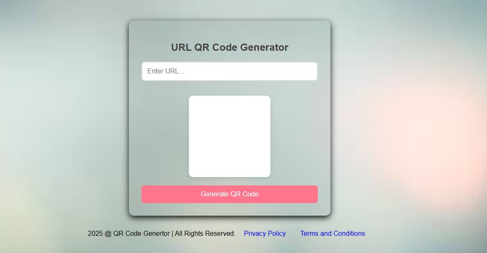

# Smart-Encode
This is Smart-Encode web application that the put link and get the clear QR code generate ,that QR download,color choice that user 
# URL-QR-Code-Generator-pro
 
# URL QR Code Generator

## 📌 Project Overview
The **URL QR Code Generator** is a simple and efficient web application that allows users to generate QR codes from URLs. It also provides an option to download the generated QR code.

## 🚀 Features
✅ User-friendly interface  
✅ Generates QR codes instantly  
✅ Download QR codes as PNG images  
✅ Reset option to clear the QR code  
✅ Fully responsive design  

## 🛠️ Technologies Used
- **Frontend:** HTML, CSS, JavaScript  
- **Library:** [QRCode.js](https://cdnjs.cloudflare.com/ajax/libs/qrcodejs/1.0.0/qrcode.min.js)  

## 📖 How to Use
1. Open `index.html` in a web browser.  
2. Enter a valid URL in the input field.  
3. Click **"Generate QR Code"** to create a QR code.  
4. Click **"Download QR Code"** to save it as an image.  
5. Use the **"Reset"** button to clear the QR code and start over.  

## 📸 Screenshot

## 🏗️ Installation & Setup
No installation is required. Simply open `index.html` in any modern web browser.
